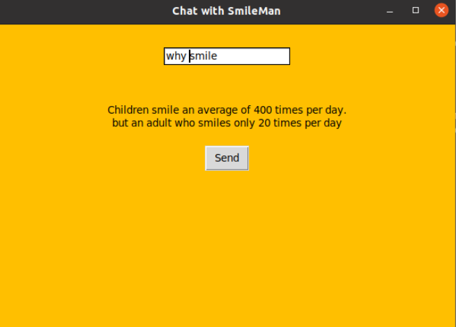
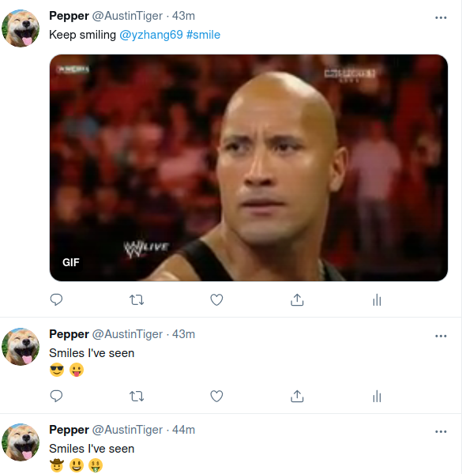

# Pepper The SmileBot

## Inspiration
Whether you call it a grin, smirk, beam or smile,there’s no denying the feel-good power of this happy facial expression.
We are born with the ability to smile, yet as we age, we smile less often.
    
Research shows that children smile an average of 400 times per day,
    compared to the average happy adult who smiles 40-50 times per day
    and the typical adult who smiles only 20 times per day.
    
I always believe that robots should make the world a better place. 
    So I started to build Pepper aka the smile bot

## Technologies
At first, I was using Raspberry pi 4 and its own camera. However, raspberry always throws me some errors when using OpenCV and other libraries and it is quite slow. I tried many ways to fix these issues but none of them are satisfying so I switched to the webcam which had much higher resolution and much faster. 

Most of the tech stuff is on python. I used so many libraries to make this bot lol. You can find them in the requirement.txt file. 
## Smile Detection on OpenCv
First part I built is smile detection using opencv. The classification I used is Haar feature-based cascade classifiers which is an effective object detection method. By using provided cascade classifier, I can detect face and eye as well as smile. When Pepper detected smile, it will draw a bounding box around my face.
## Interaction With Pepper
When a smile is detected, I will have a conversation with the bot. At first, I was trying Twilio but it was not successful. The phone number I get from Twilio must go through a registration process which could take many weeks. Then I trying to use discord bot but I encountered many problems in concurrent programming which is super crazy stuff about python. At last, I decided to build my own UI with Tkinter. 

I can type in the input field and Pepper will reply to the input text. All these conversations scripted using RiveScript

## Tweets and Count Smiles 
When I am done with chatting, Pepper will become a tweeter bot when she did not see a smile. She will tweet how many smiles were seen so far using emoji and she will also @ me with gifs if she did not see smiles for some time. 
Check out Pepper's [twitter](https://twitter.com/AustinTiger)

## Further Development

Idealy, this python code should be able to run on a raspberry pi. I need to figure out all the libraries' problem hopefully. 

During the development of this bot, I really smiled a lot. And Pepper does help me to feel better during this final time. I will keep develop Pepper and makes her more helpful and more smiles. 
